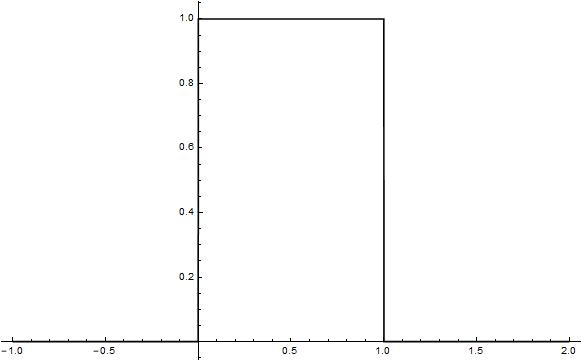
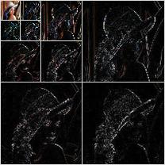

# 从线性代数到小波变换

## 来自线性代数的几个定义和引理

**定义1**：向量空间

一个向量空间是由一些被称为**向量**的对象构成的非空集合$\vec{v}$，在这个集合上定义两个运算，称为**加法**和**标量乘法**（标量取实数），服从以下公理，这些公理必须对$\vec{v}$中所有向量$\vec{u}$, $\vec{v}$, $\vec{w}$及所有标量$c$和$d$均成立

1. $\forall \vec{u}, \vec{v} \in \vec{v}\ \Rightarrow\ \vec{u} + \vec{v}\in \vec{v}$
2. $\vec{u} + \vec{v} = \vec{v} + \vec{u}$
3. $(\vec{u} + \vec{v}) + \vec{w} = \vec{u} + (\vec{v} + \vec{w})$
4. $\exist \vec{0}\in \vec{v}\ \Rightarrow\ \vec{u} + \vec{0} = \vec{u}$
5. $\forall \vec{u}\in \vec{v},\ \exist -\vec{u}\in \vec{v}\ \Rightarrow\ \vec{u} + (-\vec{u}) = \vec{0}$
6. $c\vec{u}\in \vec{v}$
7. $c(\vec{u} + \vec{v}) = c\vec{u} + c\vec{v}$
8. $(c + d)\vec{u} = c\vec{u} + d\vec{u}$
9. $c(d\vec{u}) = (cd)\vec{u}$
10. $l\vec{u} = \vec{u}$

只要符合上述公理的代数系统就可以称为是向量空间。

**定义2**：子空间

向量空间$V$的一个子空间是V的一个满足以下三个性质的子集H：

- $\vec{0}\in V \ \and\ \vec{0}\in H$
- $\forall \vec{u}, \vec{v}\in H\Rightarrow \vec{u}+\vec{v}\in H$
- $\forall \vec{u}\in H\ \and\ \forall c\in \mathbb{R}\Rightarrow c\vec{u}\in H$

**定义4**：线性无关集

如果在向量空间$V$中的一个向量集$\{\vec{v}_1, \cdots, \vec{v}_p\}$，当且仅当$c_1=c_2=\cdots=c_p=0$时满足
$$
c_1\vec v_1 +c_2\vec v_2+\cdots + c_p\vec v_p = \vec 0
$$
就成该向量集是一个线性无关集

**定义4**：基

令$H$是向量空间$V$的一个子空间，$V$中向量的一个向量集$\vec{B} = \{\vec{b}_1, \cdots, \vec{b}_p\}$是$H$中的一个基，必须满足

- $\vec{B}$是一个线性无关集
- 由$\vec B$生成的子空间与$H$相同，即$H = \mathtt{Span}\{\vec{b}_1, \cdots, \vec{b}_p\}$

**定理1**：唯一表示定理

令$\vec B$是向量空间$V$的一个基，则对$V$中每个向量$\vec{x}$，存在唯一的一组数$c_1, \cdots, c_n$，使得
$$
\vec{x} = c_1\vec{b}_1+\cdots+c_n\vec{b}_n
$$

## 不同基之间的坐标转换

有了前一节中的定义和引理，可以得到一个向量在不同的基之间相互转换的方式。在向量空间$V$中有基$\vec A$和基$\vec B$，有$\mathtt{Span}\{\vec A\}=\mathtt{Span}\{\vec B\}=V$，在基$\vec{A}$下有一个向量$\vec x$，要求它在基$\vec B$下的坐标$\vec c$，则有
$$
\vec x = \vec B \cdot\vec c\\
\Rightarrow\vec B^{-1}\cdot\vec x=\vec c
$$

举个例子，在$\mathbb R^2$中，令$\vec b_1=\left[\begin{matrix}2\\1\end{matrix}\right]$，$\vec b_2=\left[\begin{matrix}-1\\1\end{matrix}\right]$，$\vec x=\left[\begin{matrix}4\\5\end{matrix}\right]$，$\vec B=\{\vec b_1, \vec b_2\}$，求出$\vec x$相对于$\vec B$的坐标向量$\vec c$

**解**：这里的$\vec x$是相对于自然基而言的，套用上面的公式
$$
\left[\begin{matrix}
2&-1\\
1&1
\end{matrix}\right]
\left[\begin{matrix}
c_1\\
c_2
\end{matrix}\right]=
\left[\begin{matrix}
4\\
5
\end{matrix}\right]\\
\Rightarrow
\left[\begin{matrix}
c_1\\
c_2
\end{matrix}\right]=
\left[\begin{matrix}
2&-1\\
1&1
\end{matrix}\right]^{-1}
\left[\begin{matrix}
4\\
5
\end{matrix}\right]
$$

## 转换！

好了，现在我们把上面的讨论全部放到函数空间上

所有的一元函数$\mathbb R\to \mathbb R$组成了一个无穷维的向量空间$F$，这个空间中的每一个向量都是一个一元函数。现在取得一组基$\{\varphi_1(x), \varphi_2(x),\cdots\}$，要求任意一个一元函数$f(x)$在此基上的坐标$\{c_1, c_2, \cdots\}$

为了便于理解和类比，我们假设函数集$\varphi(x)$是离散的，$\varphi_{ij}$表示第$j$个基向量的第$i$个值，同样，这里也假定$f(x)$是离散的，$f_i$表示$f(x)$的第$i$个值那么
$$
\left[\begin{matrix}
f_1\\
f_2\\
\vdots
\end{matrix}\right]=\left[\begin{matrix}
\varphi_{11}&\varphi_{12}&\cdots\\
\varphi_{21}&\varphi_{22}&\vdots\\
\vdots&\cdots&\ddots
\end{matrix}\right]
\left[\begin{matrix}
c_1\\
c_2\\
\vdots
\end{matrix}\right]
$$
我们假设可以对这样的一个无穷维的矩阵求逆，则有
$$
\left[\begin{matrix}
c_1\\
c_2\\
\vdots
\end{matrix}\right]=\left[\begin{matrix}
\varphi_{11}&\varphi_{12}&\cdots\\
\varphi_{21}&\varphi_{22}&\vdots\\
\vdots&\cdots&\ddots
\end{matrix}\right]^{-1}
\left[\begin{matrix}
f_1\\
f_2\\
\vdots
\end{matrix}\right]
$$
这时候，我们把$f(x)$变得连续，把$\varphi_n(x)$变得连续，甚至连$n$也是在实数域的时候，$\vec c$也将变成一个连续的函数$c(t)$。上面的式子就只能用抽象的方法来表述了
$$
\vec c(t)=\Phi^{-1} f(x)
$$
其中的系数函数自变量取$t_0$的时候，就应该用如下的方式计算
$$
c(t_0)=<\Phi_{row=t_0}^{-1}(x), f(x)>=\int \Phi_{row=t_0}^{-1}(x), f(x)dx
$$
这样就能明白什么叫做**基函数的对偶空间**了，它应该可以概括为**一个基变换矩阵的逆的行向量所张成的空间**。

抽象的是，上面的这个$\Phi$矩阵并不是一个通常所见的矩阵，它的每两行与每两列之间都是连续的，说是矩阵，不如说是一个二元的函数。至于对它的求逆如何求解，就更是不知道如何定义了。

## 新的思考

在几天的思考中，大概对小波分析有如下的认识：

- 将函数视作无穷维的向量，选取一组基函数作为基用来表示$f(x)$，这个用于拟合$f(x)$的级数就是**基向量与系数向量的点积**
  - 系数向量由基函数的对偶函数与$f(x)$的点积求得，对偶函数的求法未知。但如果基函数是两两正交的，那么基函数与它的对偶函数一致
  - 基函数的选取尽量是正交的，而且是**紧支撑的**
- 假设选取了一组紧支撑的函数，那么函数非零值的宽度决定了"分辨率"，系数向量决定了强度。**宽度小的函数所张成的空间必定包含宽度大的函数所张成的空间**。这样的函数称为"尺度函数"。
- 假设一个宽度小的函数（组）张成空间$V_1$，另一个宽度大的函数（组）张成空间$V_2$，则$V_2$包含于$V_1$，$V_1-V_2$的基函数（组）称为小波函数

- 如果用尺度函数表示$f(x)$，则每次分辨率的增加都会使无穷级数整体发生变化，而如果用小波函数表示f(x)，则每次分辨率的增加就是在级数的末尾增加一个（组）尾项

## 用无穷级数表示函数

泰勒级数和傅里叶级数都是通过无穷级数的方法来拟合一个函数，只是所选取的基函数不同（一个是幂函数，一个是三角函数）。用通式表示，假设有一个基函数组$\{\varphi_k(x)\ |\ k\in \mathbb{Z}\}$
$$
f(x)=<\vec \varphi, \vec c>
$$

这里采用前面说到的无穷向量空间的概念，将函数和系数都视作一个向量。此处的$\vec c$指级数的**系数向量**

这里我们暂且不管系数向量如何求得，单单看求解的过程。作为一组基向量，它们可以在无穷向量空间中表达的所有点可以组成一个子空间$V$，称作向量组**张成**一个子空间$V$，记作$\mathtt{Span}\{\varphi_k(x)\ |\ k\in \mathbb{Z}\}=V$

假设有一个紧支撑的基础函数$\varphi(x)$，比如如下面这个函数



由这个函数生成一组基函数，用来表示整个$L^2(\mathbb{R})$，这组基函数为$\{\varphi_{j,k}\}$
$$
\varphi_{j,k}(x)=\sqrt{2^j}\varphi(2^jx-k)
$$

```mathematica
Animate[Plot[
  Sqrt[2^j] WaveletPhi[HaarWavelet[], 2^j x - k], {x, -1, 2}, 
  Exclusions -> None, PlotTheme -> "Monochrome", 
  PlotRange -> {{-1, 3}, {-0.5, 2}}], {j, 0, 1}, {k, 0, 1}, 
 AnimationRunning -> False]
```

上面的`Mathematica`程序将给出（10）式中$j$和$k$的变化对函数形状的影响，其中，$j$越大函数越高且窄（非零部分），$k$则是调节非零部分位置的。

如果$j$和$k$都是整数的话，就可以得到下面的结论：

- $j$一致的时候，$k$按整数单位移动的时候可以得到一组非零值互不相交的函数组，这组函数的宽度是不变的。显然，有大量的$f(x)\in L^2(\mathbb R)$是不能被这组函数线性表示的，也就是说，这组函数所张成的空间是$L^2(\mathbb R)$的子空间。设此时的$j=j_0$
  $$
  \mathtt{Span}\{\varphi_{j_0,k}(x)\ |\ k\in \mathbb Z\}\subset L^2(\mathbb R)
  $$

- 当$j_1-j_2=1$的时候，$k$相同，那么两个函数的非零区域宽度**正好相差一半**，也就是说，以$j_1$为底的$\varphi(x)$可以完全表示以$j_2$为底$\varphi(x)$表示的函数。即
  $$
  \mathtt{Span}\{\varphi_{j_2,k}(x)\ |\ k\in \mathbb Z\}\subset \mathtt{Span}\{\varphi_{j_1,k}(x)\ |\ k\in \mathbb Z\}
  $$
  一般地，$j_m>j_n$时，后者张成的空间都是前者张成空间的子集（这里两者都是整数）

- 记$\mathtt{Span}\{\varphi_{j,k}(x)\ |\ k\in \mathbb Z\}=V_j$，则
  $$
  0=V_{-\infty}\sub \cdots\sub V_{-2}\sub V_{-1}\sub V_0\sub V_1\sub V_2\sub\cdots\sub V_{\infty}=L^2(\mathbb R)
  $$


以上的几个结论说明，$j$的不同可以带来不同程度的对函数的拟合。极限情况下，就是仅能拟合出零函数或者能精确拟合任意函数。我们举例来看，假设$V_j$的基函数被$V_{j+1}$中的函数拟合，则表示为
$$
\varphi_{j,k}(x)=<\vec \varphi_{j+1}(x),\vec\alpha>=\sum_n \alpha_n\varphi_{j+i,n}(x)
$$
将系数$\alpha$表示为一个函数$h_\varphi$，则由（10）可将上式变为
$$
\varphi_{j,k}(x)=\sum_n h_\varphi(n)\sqrt{2^{j+1}}\varphi(2^{j+1}x-n)
$$
令$j=0,k=0$，则
$$
\varphi(x)=\sum_n h_\varphi(n)\sqrt{2}\varphi(2x-n)=<\sqrt 2 \vec \varphi(2x),\vec h_\varphi>
$$
这里称$\vec h_\varphi$为**尺度向量**，$\varphi(x)$称为**尺度函数**。上面（16）式形成了一个递归等式，说明**任意子空间的展开函数，都可以由其本身的双倍分辨率副本建立，即来自相邻较高分辨率空间的展开函数。**

## 小波函数

定义一个函数$\psi(x)$，与上一节相同，$\psi(x)$生成一组函数$\{\psi_{j,k}(x)\ |\ j\in\mathbb Z,k\in\mathbb Z\}$
$$
\psi_{j,k}(x)=\sqrt{2^j}\psi(2^jx-k)
$$
由一个固定的$j$张成的空间记作
$$
W_j=\mathtt{Span}\{\psi_{j,k}(x)\ |\ j\in\mathbb Z,k\in\mathbb Z\}
$$
这里的定义和结论与上一节有相同的地方，但不同的是，这里所定义的函数$\psi(x)$所张成的空间之间没有交集，具体而言
$$
V_{j+1}-V_j=W_j
$$
要注意，我们这里仅仅描述$\psi(x)$具有这样的性质，而没有给出求得$\psi(x)$的方法。可以猜想，此处的$\psi(x)$和尺度函数$\varphi(x)$有着很紧密的关系。

有这样性质的函数，那么由（19）可以得到
$$
V_{j+1}=V_j\cup W_j
$$
更进一步的，
$$
L^2(\mathbb R)=V_0\cup W_0\cup W_1\cup\cdots\cup W_\infty
$$
也可以表示为
$$
L^2(\mathbb R)=W_{-\infty}\cup\cdots\cup W_{-1}\cup W_0\cup W_1\cup\cdots\cup W_\infty
$$
由于$W_j\sub V_{j+1}$，所以（16）式中的结论可以应用到小波函数中，即
$$
\psi(x)=\sum_n h_\psi(n)\sqrt{2}\varphi(2x-n)=<\sqrt 2 \vec \varphi(2x),\vec h_\psi>
$$
其中，$\vec h_\psi$称为小波向量。这里的$\vec h_\psi$和$\vec h_\varphi$有如下的关系
$$
h_\psi(n)=(-1)^nh_\varphi(1-n)
$$

## 一维小波变换

### 小波级数展开

根据上面两节的叙述，可以知道对于一个函数$f(x)$，可以有展开式
$$
f(x)=<\vec\varphi_{j_0},\vec h_{\varphi,j_0}>+\sum_{j=j_0}^\infty<\vec \psi_j,\vec h_{\psi,j}>
$$
如果展开函数形成一个正交基（基函数组形成了一个对称矩阵），那么
$$
\vec h_{\varphi,j_0}=\left[\begin{matrix}
\varphi_{j_0,k_0}\\
\varphi_{j_0,k_1}\\
\varphi_{j_0,k_2}\\
\vdots
\end{matrix}\right]\cdot \vec f(x)\qquad
\vec h_{\psi,j}=\left[\begin{matrix}
\psi_{j,k_0}\\
\psi_{j,k_1}\\
\psi_{j,k_2}\\
\vdots
\end{matrix}\right]\cdot \vec f(x)
$$

## 二维小波变换

相比于一维的小波变换，二维小波变换需要**一个**二维尺度函数$\varphi(x,y)$和**三个**二维小波函数$\psi^H(x,y)$，$\psi^V(x,y)$和$\psi^D(x,y)$。其中$\psi^H(x,y)$度量沿列方向的变化（例如水平边缘），$\psi^V(x,y)$相应沿行方向的变化（例如垂直边缘），$\psi^D(x,y)$度量对应对角线方向上的变化。

类似于一维的情况，一张图像可以视作一个二维的离散化函数。原图像视为一个高维近似，它可以用尺度函数$\varphi(x,y)$表示成一个长宽都是原图像一半的低维近似，另外还有用三个小波函数表示的余项，这样就将原图像分解成了四张长宽都是原图像一半的子图。下面的图像通过Mathematica生成



其中最左上角的那个小块就是$V$空间中的图像近似，使用尺度函数进行表示的。其余的所有图像都是通过小波函数在三个方向上的分解产生的。